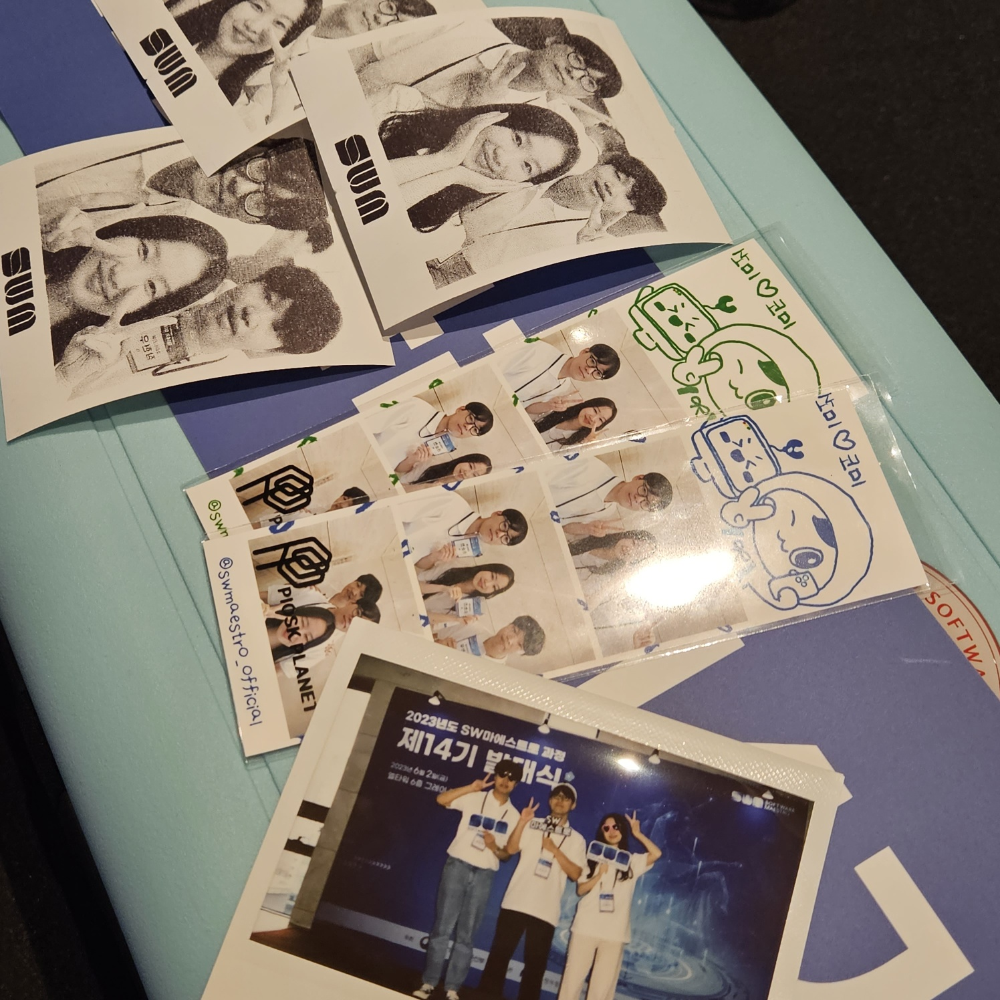
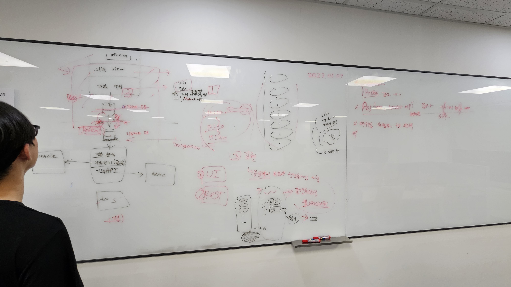
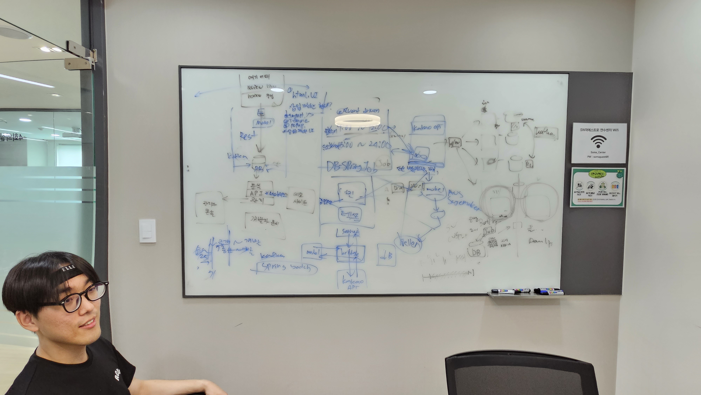
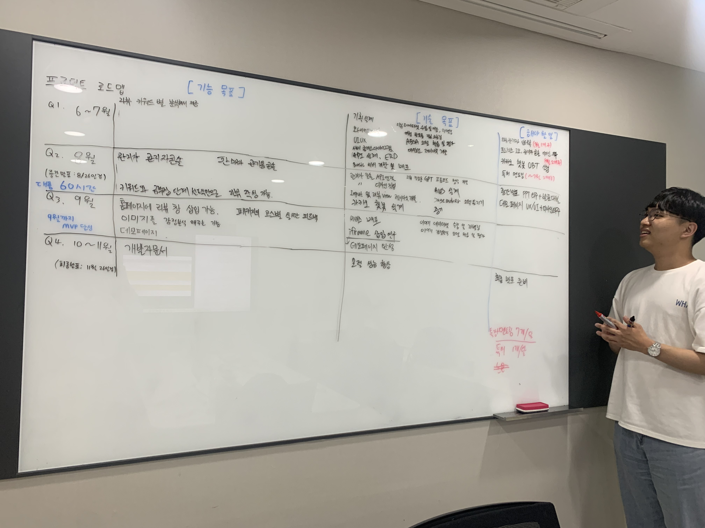
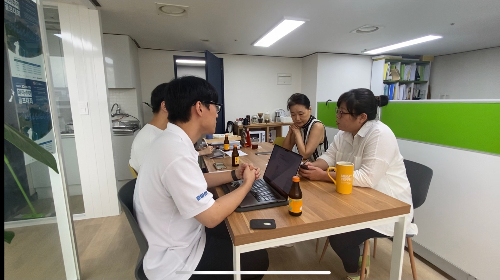
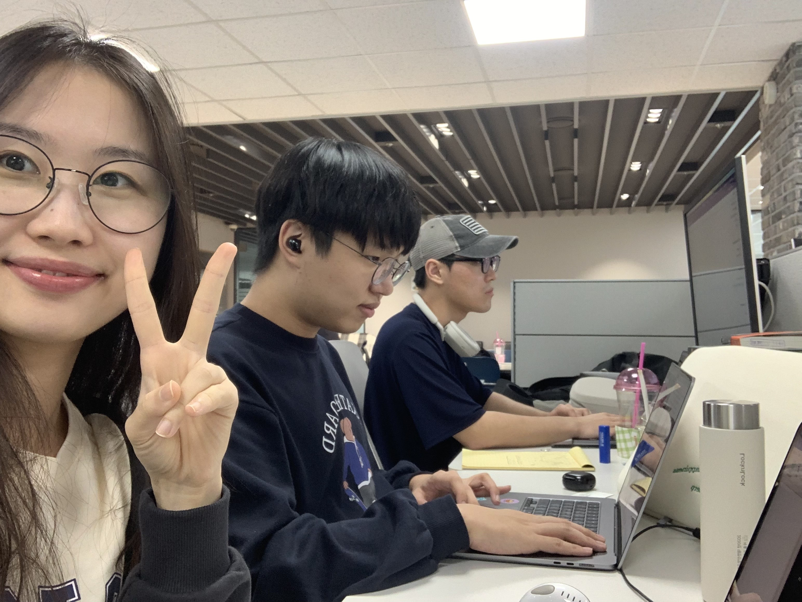

## 🔎 여행 리뷰 통합 관리 플랫폼
# Review Mate 

`#각자` `#핵심기술` `#적기` `#NLP` `#ABSA` `#GPT-4` `#Next.js` `#React.js`

## Overview

리뷰메이트는 고객의 리뷰를 통해 여행 상품의 구매 전환율을 상승시키는 리뷰 통합 관리 플랫폼입니다.

## Contents
- 가나다
- 라
- 마
- 바
- 사

## 프로젝트 기획
- [Product vision](./Product_Vision.md)
- [User Story](./User_Story.md)
- [Usecase Diagram](./Usecase_Diagram.md)

## 서비스 아키텍처

## 🛠 Tech Stacks
### Back-end
### Front-end

### (사진 편집중)
 
   
### AI

## 👥 Members

|Reader / Backend|Frontend|Data / AI|
| :-: | :-: | :-: |
 |  |  |
|  [Kwon Soonchan](https://github.com/Kwon770)  |  [So Hyeonjin](https://github.com/hyeonjin25)  |  [Jang Hyunwoo](https://github.com/J-nowcow)  |

### ETC
- 중간 발표자료 [pdf](./files/2-18.%20소마트리뷰%20(발표자료).pdf) [ppt](./files/리뷰메이트_중간발표자료%20(최종).pptx)
- [정보 구조도](./files/정보%20구조도%20&%20시간%20예측.xlsx)
- 사진첩

||||
| :-: | :-: | :-: |
||||
